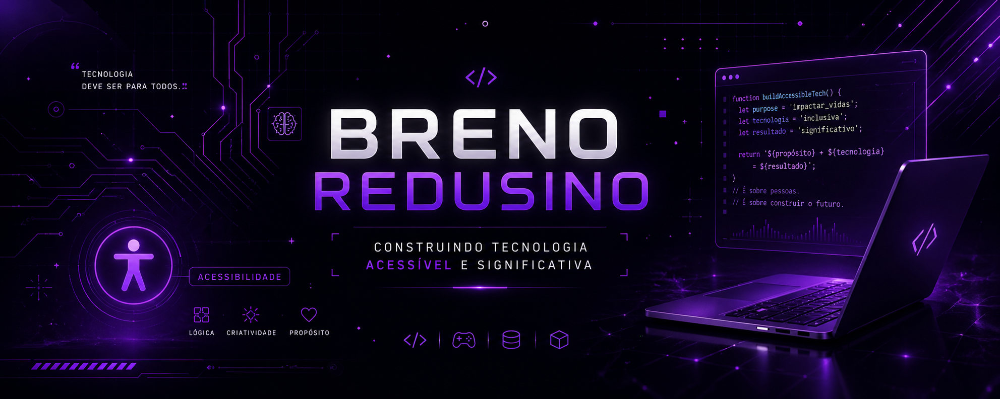

---

## 💡 Sobre mim

🎓 Estudante de Ciência da Computação  
⚙️ Background em usinagem (SP Skills)  
🎮 Criador de projetos que unem lógica, criatividade e propósito  

💭 "Acredito que tecnologia deve ser acessível, intuitiva e impactar pessoas".

---

## 🚀 Atualmente

- 🎯 Em formação para me tornar desenvolvedor full stack  
- 🌐 Estudando front-end e back-end na prática
- 💼 Dando os primeiros passos no mercado de tecnologia  
- 🎮 Criando projetos com identidade própria, unindo design, lógica e propósito  

---

## 🛠 Tecnologias

### 💻 Linguagens

---

### 🌐 Front-end

---

### ⚙️ Back-end & Ferramentas

---

### 🎮 Outros

---

## 🌟 Projetos em destaque

### 🌐 [Portfólio](https://github.com/yBreno/portifolio-html)  
Meu portfólio pessoal, onde apresento meus projetos, evolução e identidade como desenvolvedor.  
Focado em design moderno, responsividade e experiência do usuário.

---

### 🎲 [All-Count](https://github.com/yBreno/All-Count)  
Jogo educativo desenvolvido para alunos da APAE, com foco no ensino de matemática de forma acessível e intuitiva.  
O projeto busca transformar o aprendizado em uma experiência visual, interativa e inclusiva.

---

### 🎮 [GameBoxd](https://github.com/yBreno/GameBoxd)  
Plataforma inspirada no Letterboxd, voltada para jogos.  
Permite registrar, organizar e explorar experiências com games.

---

### 👁️ [Tactic Eye](https://github.com/yBreno/Tactic-Eye)  
Web crawler desenvolvido em Python para coletar e organizar notícias do cenário de Valorant e e-sports.  
Focado em automação e estruturação de dados.

---

## 🎮 Sobre mim

- 🎮 Minecraft me ensinou lógica e criatividade  
- 💜 Estética preta e roxa  
- 🧠 Gosto de transformar ideias em soluções reais  
- 🚀 Sempre evoluindo  

---

## 📫 Onde me encontrar

---

💭 *"Tecnologia deve ser para todos e eu quero ajudar a construir isso."*

