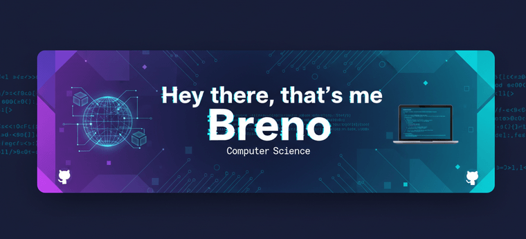

💻 Mecânico de Usinagem e estudante de Ciência da Computação  
⚙️ Ex-competidor da SP Skills • Explorando o elo entre mecanica e tecnologia  
🌐 Apaixonado por desenvolvimento, design e inovação com propósito humano  

📚 Atualmente aprendendo e criando com:  
Python • Flask • SQLite • Git • HTML • CSS • JavaScript • C++ 

🎮 Games e criatividade sempre fizeram parte do meu caminho — Minecraft e Genshin Impact me ensinaram tanto sobre lógica quanto sobre imaginação.  

💜 Tecnologia com estética roxa e preta.

---

## 🚀 O que me motiva
Transformar ideias em projetos reais e acessíveis.  
Acredito que tecnologia é uma forma de acessibilidade — unir técnica e sensibilidade é o que me motiva.

---

## 🌐 Onde me encontrar

---

⚙️ Acredito que tecnologia deve ser para todos — por isso, busco criar projetos acessíveis, inclusivos e cheios de propósito.
